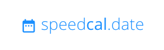

<p  align="center"></p>

<p align="center">
  <a href="#" title="API Branch: master"></a> <a href="#" title="API Branch: dev"></a>
</p>


# SpeedCal.Date

Quick &amp; easy calendar screenshots for download or embedding in other sites.

## Usage

1. Visit the app
1. Configure a calendar
1. Visit the generated URL

## Development

In the project directory, you can run:

### `npm install`

Installs project dependencies.

### `npm start`

Runs the app in the development mode.<br />
Open [http://localhost:3000](http://localhost:3000) to view it in the browser.

The page will reload if you make edits.<br />
You will also see any lint errors in the console.

### `npm test`

Launches the test runner in the interactive watch mode.<br />
See the section about [running tests](https://facebook.github.io/create-react-app/docs/running-tests) for more information.

### `npm run build`

Builds the app for production to the `build` folder.<br />
It correctly bundles React in production mode and optimizes the build for the best performance.

The build is minified and the filenames include the hashes.<br />
Your app is ready to be deployed!

See the section about [deployment](https://facebook.github.io/create-react-app/docs/deployment) for more information.

## Learn More

### Deployment

TBD

### `npm run build` fails to minify

This section has moved here: https://facebook.github.io/create-react-app/docs/troubleshooting#npm-run-build-fails-to-minify

### Docker

The API can be run in a containerized format, using [Docker-Compose](https://docs.docker.com/compose/):

```sh
# Wait for the build, then visit http://localhost:3001/stats in browser
docker-compose up -d

# View container logs
docker-compose logs
```

... or by executing the Docker build step manually:

```sh
docker build -f ./docker/api/Dockerfile -t speedcal-api .
```

## Technology Reference

The following technology is utilized in this project:

- [React](https://reactjs.org/)
- [Amazon Elastic Container Service](https://aws.amazon.com/ecs/)
- [Github Actions](https://help.github.com/en/actions)
- [Puppeteer](https://github.com/puppeteer/puppeteer)

## Contributors

<a href="https://github.com/mxrosenthal"></a> <a href="https://github.com/emcniece"></a>

